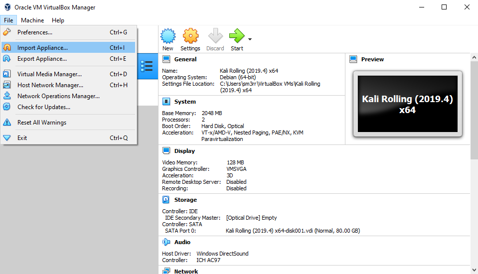
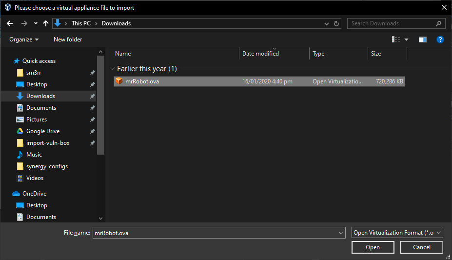
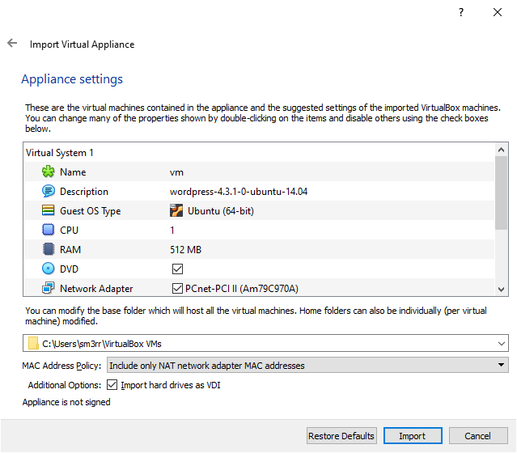
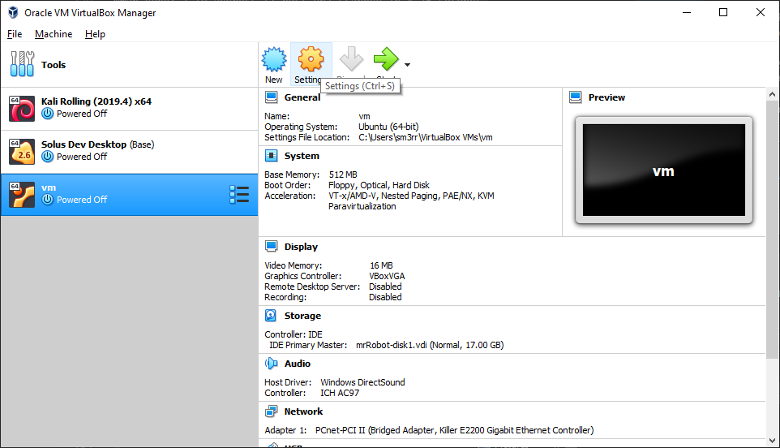
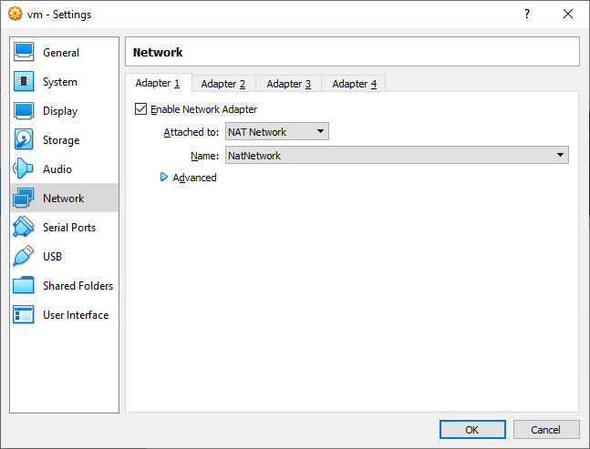

# Importing a Vulnerable VM

1. Click File > Import Appliance

2. Find your downloaded ***.ova** appliance

3. Accept the default VM settings

4. Once the VM has imported, open the settings.

5. Set the VM to use NAT your network. See [Setup Nat Network](#setup-nat-network.md) for details on setting up a nat network.
