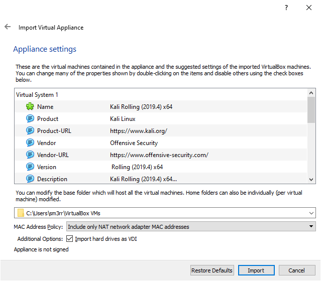
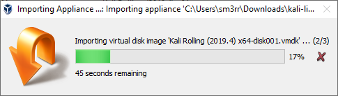

# Setting up a workspace with Kali Linux and Virtualbox

Kali linux is a debian based linux distribution which comes preinstalled with hundreds of tools designed for penetration testing.

While these tools are readily available for installation on most linux istributions, kali linux comes pre installed with all of the most common tools and is the fastest and easiest way to get started.

The kali images we will use are ready to use, prebuilt, virtual machine images from the official kali website.

## Steps to install

Download and install Oracle Virtualbox 
https://www.virtualbox.org/wiki/Downloads

Download a Kali Linux Virtualbox Appliance 
https://www.offensive-security.com/kali-linux-vm-vmware-virtualbox-image-download/#1572305786534-030ce714-cc3b

Import Kali Linux to virtualbox 
  - Click **File** > **Import**. 
  - Find the downloaded image and click **Open**. 
  - Click **Next**. 
  - Click **Import** to accept the default settings. You can modify settings such as CPU and Memory limits here or you can do it in the settings later. 
  - Wait for the appliance to finish importing. 

Open the settings for the VM by selecting the VM and clicking **Settings** 

Go to 'USB', change the USB controller to `USB 1.1 (OHCI) Controller` and click **Ok**. (otherwise you will get [this error](img/kali-vbox-setup/5.png))

Start the virtual machine. 

Press **&lt;enter&gt;** to select `Kali GNU/Linux` (hightlighed). 

If you are presented with a pop up like this Click **Capture**. 

Login to the virtual machine. The default username and password depends on the when you downloaded Kali and what the latest version was at the time.

Version|Username|Password|Note|
|---|---|---|---|
|Kali Rolling (2019.4) x64|`root`|`toor`|Root user - you do not need to use `sudo` command for anything|
|Kali Rolling (2020.1) x64|`kali`|`kali`|Standard privileged user - become root using `sudo -s`|

**Welcome to kali linux**

>"The quieter you become, the more you are able to hear"

## Next Steps

 * [Setup a nat network](setup-nat-network.md) and configure VM to use it.
 * [Enable the eth0 interface for Kali Linux](kali-enable-eth0.md)
