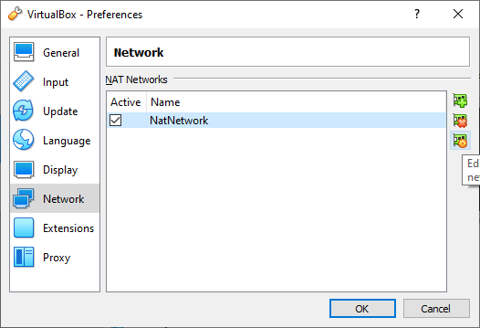

# Setup Nat Networking between two Virtual Machines

>NAT = Network Address Translation

Setting up a NAT network between two virtual machines allows us to create a
semi private network where our virtual machines can talk to one another - but
nobody else on the network can talk to them.

## 1. Creating a NAT Network

Open File > Preferences > Network

Click on the green `+` on the right to add a new nat network.

View the configuration of the new `NatNetwork` by selecting it and clicking the Settings cog on the right.

The default settings populated by Virtual Box automatically should look like this.

Click **Ok** to save the new network

## 2. Configuring Virtual Machines to use your NAT Network

Select a VM and open **Settings** > **Network**

Set `Attached to:` to NAT Network and select your NAT network from the list.

Click **OK** to save the configuration and close the settings.

>**Note** Repeat for both your Vulnerable VM and you Kali Workstation VM